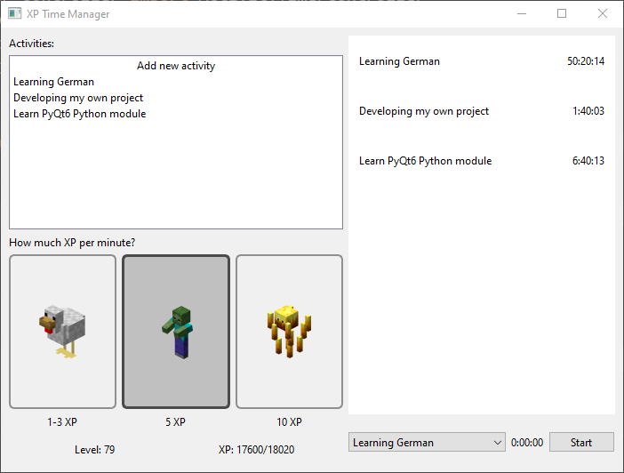

# XP Time Manager 🎮⏱️


*XP Time Manager main interface*

## Overview
XP Time Manager is a unique productivity application that gamifies time tracking by incorporating Minecraft-inspired gaming elements. Turn your daily tasks into an engaging experience where you earn XP, level up, and track your productivity progress just like in Minecraft!

## Features

### Core Features
- **Time Tracking**: Record and monitor how you spend your time with detailed entries
- **Activity Management**: Create, edit, and delete custom activities to track
- **History Viewer**: Analyze your productivity patterns through past time entries

### Gaming Elements
- **XP System**: Earn experience points for your time spent productively
- **Level Progression**: Level up as you accumulate XP, similar to Minecraft's system
- **Customizable XP Rates**: Choose different Minecraft mobs to determine your XP earning rate per minute
- **Activity Statistics**: Track your progress and achievements over time

## Setup

### Prerequisites
- Python 3.8 or higher
- pip (Python package installer)

### Installation
1. Clone the repository:
   ```bash
   git clone https://github.com/bogdan-sobol/xp-time-manager.git
   cd xp-time-manager
   ```

2. Create and activate a virtual environment (recommended):
   ```bash
   python -m venv venv
   # On Windows:
   .\venv\Scripts\activate
   # On macOS/Linux:
   source venv/bin/activate
   ```

3. Install dependencies:
   ```bash
   pip install -r requirements.txt
   ```

4. Run the application:
   ```bash
   python main.py
   ```

### Troubleshooting
- If you encounter visual issues (such as a gray background in the history section), verify that `DEBUG_MODE` is set to `False` in `src/utils/constants.py`
- For PyQt6 installation issues, ensure you have the latest pip version: `pip install --upgrade pip`

## Project Status
This project is under active development. While it's functional for basic use, expect regular updates and improvements.

## To-Do List

### New Features
- [x] Activity history management with deletion functionality
- [x] Activity management system (add/delete activities)
- [x] Minecraft-inspired XP and Level system
- [x] Customizable XP rates based on Minecraft mobs
- [ ] Daily streaks system (track consecutive days where user meets minimum time goals)
- [ ] Activity statistics dashboard showing time spent per activity and total time tracked
- [ ] Hierarchical activity structure with main activities and sub-activities in separate tabs
- [ ] Achievements system

### Improvements
- [ ] Date-based grouping for activity history, organizing entries by day
- [ ] Persistent settings (window positions, selected XP rate, and last selected activity)
- [ ] Redesign XP and level bar to match Minecraft's visual style

### Bug Fixes
- [ ] Prevent time tracking when no activities are available
- [ ] Disable activity deletion while time tracking is in progress